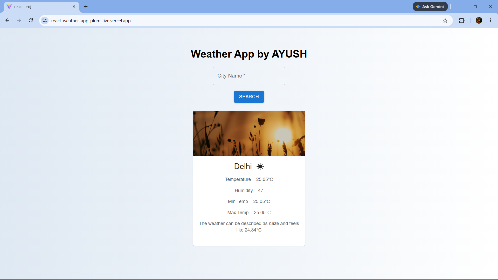

# 🌦️ React Weather App

> A modern weather application built using React and Vite that provides real-time weather information for cities worldwide.

React Weather App is a frontend web application that allows users to search weather conditions by city name and view real-time weather details including temperature, humidity, min/max temperature, and weather conditions using the OpenWeather API.

## 🚀 Live Demo

🌐 Live Website: https://react-weather-app-plum-five.vercel.app

## 🔗 GitHub Repository

💻 GitHub: https://github.com/ayushraj78088/react-weather-app

## 📸 Screenshots

### Weather Search Interface



## ✨ Features

- 🔍 Search weather by city name
- 🌡️ Real-time temperature and weather details
- 💧 Humidity, feels-like, min/max temperature data
- 🌤️ Dynamic weather icons and background images
- ⚡ Fast and responsive UI
- 🔐 Environment variables support using `.env`
- 🎨 Clean UI built with Material UI

## 🛠️ Tech Stack

### Frontend

- React
- Vite
- JavaScript
- CSS

### UI Library

- Material UI (MUI)

### API

- OpenWeather API

## 📂 Project Structure

```bash
src/
│
├── components/
│   ├── InfoBox/
│   ├── SearchBox/
│   └── WeatherApp/
│
├── App.jsx
├── App.css
├── main.jsx
└── index.css
```

## 💻 Running the Project Locally

To run this project on your local machine, follow these steps:

### 1. Clone the Repository

```bash
git clone https://github.com/ayushraj78088/react-weather-app.git
cd react-weather-app
```

### 2. Install Dependencies

```bash
npm install
```

### 3. Create Environment Variables

Create a `.env` file in the root directory and add:

```env
VITE_API_URL=https://api.openweathermap.org/data/2.5/weather
VITE_API_KEY=your_openweather_api_key
```

### 4. Start the Development Server

```bash
npm run dev
```

The app should now be running on:

```bash
http://localhost:5173
```

## 🏗️ Build for Production

```bash
npm run build
```

---

_If you like this project, please consider giving it a ⭐ on GitHub!_